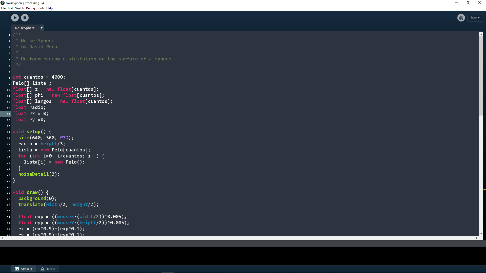

# Processing-DarkArc-Theme (Tested for 3.4)
## DO NOT JUST PUT IT IN YOUR PROCESSING FOLDER
Colours are based off of the netbeans Dark Arc theme  

There are two files, one that belongs in your Processing folder, the other in your Applications folder.

**It is recommended that you make a copy of these files incase you do not like the theme.**  

The lib file contains the colours for the background and colours of the Processing window.  

This file belongs in processing-3.4>lib.  

The prefrences.txt file contains the colours for keywords and functions such as, comments, void, int, boolean, for, while, ect.

**If you are using a school computer, you may not be able to access the Applications folder.**

The prefrences.txt file belongs in your Applications folder.  

Documents and Settings -> [username] -> Application Data -> 
   Processing -> preferences.txt (on Windows XP)

Users -> [username] -> AppData -> Roaming -> 
   Processing -> preferences.txt (on Windows Vista and 7)

~/Library -> Processing -> preferences.txt (on Mac OS X)

~/.processing -> preferences.txt (on Linux)

Again, recommended that you keep a copy of the original file.

Replace the preferences.txt file with the one you downloaded.

---

For those who want to try to make their own theme, here are some usefull links:

[A good tutorial on knowing some of the basics.](https://vimeo.com/123336486)

[The list which tells you which token id in preferences.txt does what.](https://github.com/processing/processing/blob/master/app/src/processing/app/syntax/Token.java)
  
___
  
If you want to further customize your theme, I suggest going into your processing folder and looking at 
  processing-3.4>modes>java>keywords.txt
    - With this file, you can basically create a new colour for every function if you wanted.
  processing-3.4>lib>defaults.txt
    -Good file for learning the basics
___
Thanks for reading, a little thing for those that used other languages before.
In the preferences.txt file, there is a setting called editor.completion.auto_close.
That is the setting for auto completion for (), [], and {}.
